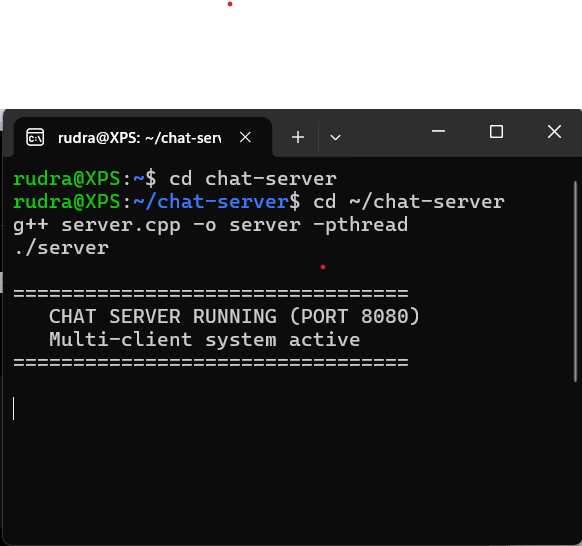
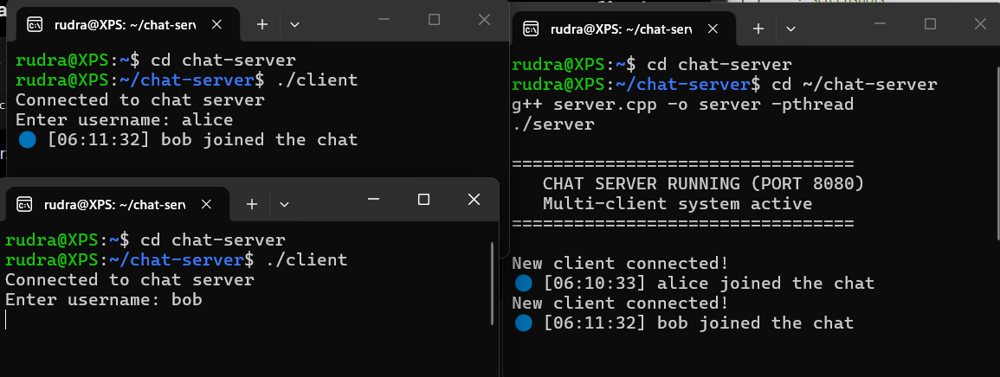
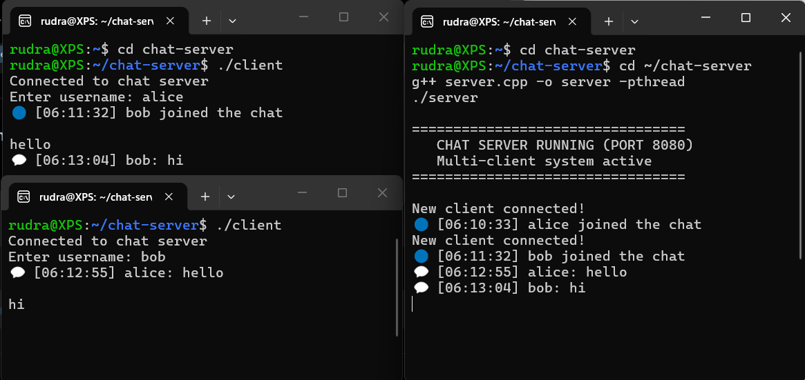
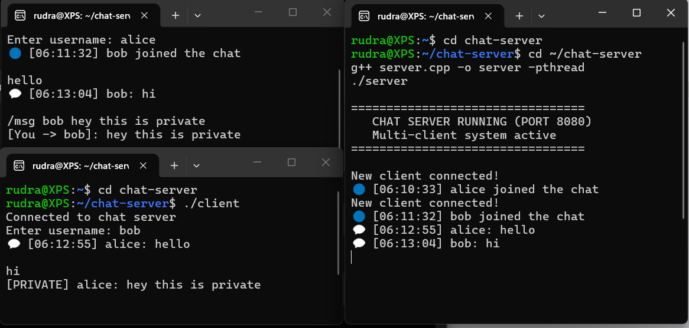

Real-Time Multi-Client Chat System (C++ / TCP / Multithreading)
Overview

A real-time multi-client chat system built in C++ using TCP sockets and multithreading. The project simulates a backend messaging system where multiple users can communicate concurrently through a central server.

The system supports real-time message broadcasting, private messaging, and message history for newly connected clients.

Features
Multi-client support with concurrent connections
Real-time message broadcasting
Private messaging using /msg <user> <message>
In-memory message history for new clients
Username-based sessions
Join/leave notifications
Command system:
/help → list commands
/users → show online users
/quit → exit chat
System Architecture

Clients → TCP Sockets → C++ Server → Message Router → Clients

The server acts as a central message router, handling all client communication and ensuring proper message delivery (broadcast or private routing).

Core Concepts Used
Socket Programming (TCP/IP)
Multithreading (std::thread)
Mutex Synchronization (thread safety)
Hash Map User Lookup (unordered_map)
In-memory Data Structures (message history buffer)
Command-based Protocol Design
Tech Stack
C++
POSIX TCP Sockets
Multithreading (std::thread)
Linux / WSL Environment
Git & GitHub
How to Run
Compile:
g++ server.cpp -o server -pthread
g++ client.cpp -o client -pthread
Run Server:
./server
Run Client (open multiple terminals):
./client
Example Usage

Public message:
alice: hello everyone

Private message:
/msg bob hey bro

Output:
[PRIVATE] alice: hey bro
[You -> bob]: hey bro

Screenshots
## Demo

### Server Running

### Multiple Clients Connected

### Public Chat

### Private Messaging

Future Improvements
Web-based chat UI (WebSockets + frontend)
Persistent database storage for messages
Scalable event-driven server (epoll-based architecture)
Authentication system (login/signup)
Encryption for secure messaging
Author

Rudra Barot